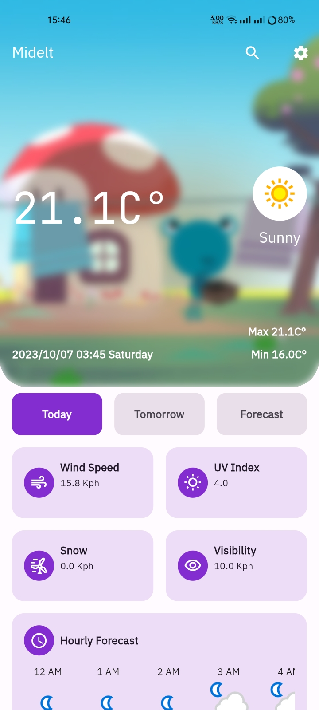
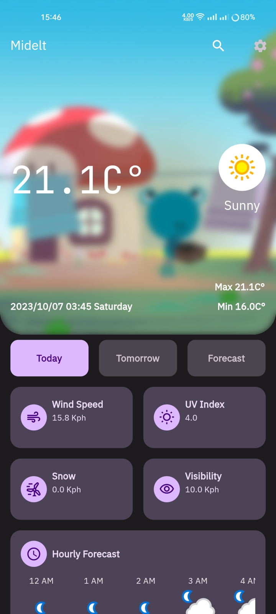

# Weather App using Flutter

Welcome to the Weather App, a simple and user-friendly application built with Flutter that provides you with accurate weather information for your chosen cities. This app supports both Arabic and English languages, offers light and dark modes for your visual comfort, and allows you to switch between Fahrenheit and Celsius for temperature units.

## Features

- **Multilingual Support**: The Weather App is available in both Arabic and English languages, making it accessible to a broader audience.

- **Light and Dark Modes**: Choose between light and dark modes to suit your visual preferences, ensuring a comfortable and enjoyable user experience regardless of the time of day.

- **Temperature Units**: Easily switch between Fahrenheit and Celsius to view temperature information in your preferred unit.

- **Search Bar**: Effortlessly search for and select cities to access weather information for your desired locations.

- **Comprehensive Weather Data**: Stay informed with detailed weather information, including:
    - **Wind Speed**: Know how fast the wind is blowing.
    - **UV Index**: Understand the level of UV radiation.
    - **Snow**: Be aware of snowfall conditions when applicable.
    - **Visibility**: Check the visibility in your area.
    - **Hourly Forecast**: Plan your day with hourly weather forecasts.
    - **Sunrise and Sunset Times**: Be aware of when the sun will rise and set.

- **Dynamic Weather Icons**: The app automatically changes weather icons to reflect the current conditions. For example, it will display a sun icon during the day and a moon or cloud icon during the night.

## Getting Started

To get started with the Weather App, follow these simple steps:

1. Clone the repository to your local machine:

   ```bash
   git clone https://github.com/OusamaTheCoder/weather-app.git
   ```

2. Navigate to the project directory:

   ```bash
   cd weather-app
   ```

3. Install the required dependencies using Flutter:

   ```bash
   flutter pub get
   ```

4. Run the app on your preferred emulator or physical device:

   ```bash
   flutter run
   ```

## Adding Your Weather API Key

To use this Weather App, you'll need to obtain an API key from [WeatherAPI](https://www.weatherapi.com/). Follow these steps to add your API key to the project:

1. Sign up for an account on [WeatherAPI](https://www.weatherapi.com/).

2. Once you have signed up and logged in, go to your dashboard or API settings to generate an API key.

3. In the project directory, navigate to `lib/core/api/end_points.dart`.

4. Find the following section in the `end_points.dart` file:

   ```dart
   class EndPoints {
     static const String apiKey = 'YOUR_API_KEY_HERE';
     // Other endpoints...
   }


## Screenshots

| Light Mode | Dark Mode |
|------------|-----------|
|  |  |

## Contributing

If you'd like to contribute to the Weather App, please follow these guidelines:

- Fork the repository on GitHub.
- Create a new branch for your feature or bug fix.
- Make your changes and test thoroughly.
- Create a pull request with a clear description of your changes.

## Issues and Feedback

If you encounter any issues or have suggestions for improving the app, please open an issue on the GitHub repository.

## Author

- **Author**: OusamaTheCoder

## Credits

The Weather App is built with love by the Flutter community. Special thanks to all contributors who have helped make this project possible.

## License

This project is licensed under the [MIT License](LICENSE).

---